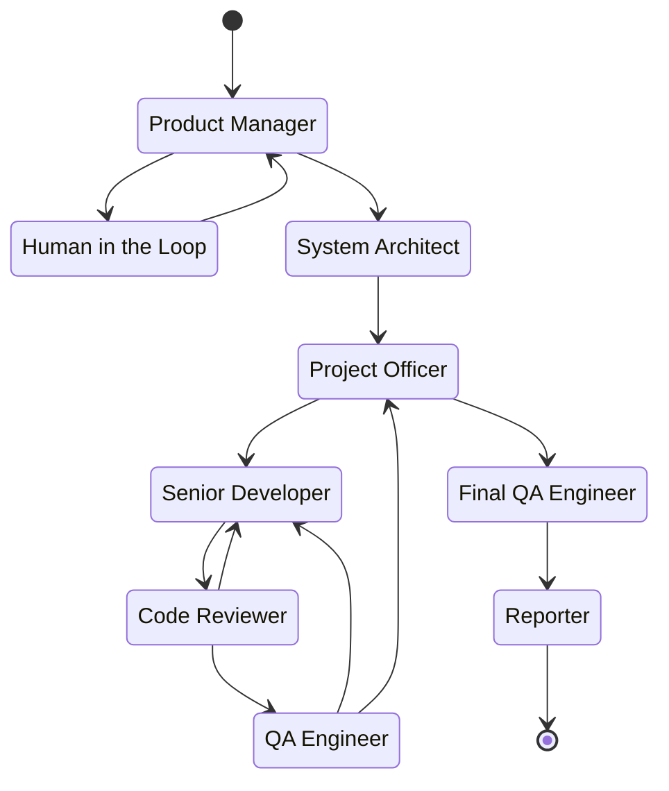

# My Dev Team 🚀

[](https://badge.fury.io/py/my-dev-team)
[](https://www.python.org/downloads/)
[](https://opensource.org/licenses/Apache-2.0)

An autonomous, LangGraph-powered AI development agency. **My Dev Team** takes raw project requirements and processes them through a multi-agent workflow (Product Manager, System Architect, Developers, and QA) to incrementally build, test, and deliver production-ready code.

**Unlike third-party SaaS platforms, My Dev Team is a local-first orchestrator.** Your workspace, SQLite state database, and review trails live 100% on your machine. You can run the entire crew locally for free using Ollama for zero data egress, or connect to cloud APIs (OpenAI, Groq) knowing your proprietary codebase is never stored on an external platform's servers.

## Core Features

* **Multi-Agent Architecture:** Specialized AI agents handle distinct phases of the software development lifecycle.
* **Local-First & Privacy-Focused:** You own your data. The orchestrator, memory checkpointer, and file system execute strictly on your local hardware. Your code and requirements never sit on a third-party dashboard.
* **Semantic Model Routing:** Automatically routes tasks to the most cost-effective or capable LLMs based on the task type (reasoning, coding, or fast-utility).
* **Strict Test-Driven Development (TDD):** Testing is never an afterthought. Tasks are generated with embedded testing criteria, and the Developer writes unit tests alongside implementation code for immediate QA validation.
* **State Recovery & Resiliency:** Powered by asynchronous SQLite checkpointing. If an API rate limit is hit or a workflow is interrupted, you can resume the exact thread without losing a single token of progress.
* **Telemetry & Cost Tracking:** Automatically tallies prompt and completion tokens across the entire workflow. Calculates exact USD costs dynamically using LiteLLM's live pricing registry, printing a detailed receipt at the end of every run.
* **Incremental Development:** The System Architect breaks down requirements into a manageable backlog of strictly formatted JSON tasks.
* **Self-Healing Code:** The Developer, Reviewer, and QA Engineer agents continuously loop until unit tests pass and code meets specifications.
* **Structured Outputs:** Powered by Pydantic and LangChain, ensuring zero "Markdown spillage" and robust state management.
* **Tool-Calling Agents:** All agents use LLM-native tool calling to submit their work, enabling free-form reasoning and thinking before structured output.
* **Extensible:** Easily add custom tools like `HumanInTheLoop` or `ConsoleLogger`.
* **Local Git Versioning:** Every line of AI-generated code is automatically version-controlled.
* **Cost & Token Optimization Analyzer:** Built-in telemetry tracks API costs down to the fraction of a cent and generates a diagnostic report at the end of every run, actively warning you if agents are stuck in loops or suffering from context bloat.

### AI Agents

1) **Product Manager:** Analyzes requirements, asks clarifying questions, and writes detailed Technical Specifications.
2) **System Architect:** Breaks specifications down into a cohesive backlog of developer tasks.
3) **Senior Developer:** Incrementally writes code and unit tests for the current task.
4) **Code Reviewer:** Analyzes the generated code for security, style, and logic issues.
5) **QA Engineer:** Evaluates code against task requirements using either LLM-based mental simulation or execution via a secure Docker sandbox.
6) **Final QA Engineer:** Performs a full-repository integration test once all tasks are complete.
7) **Reporter:** Generates a comprehensive final Markdown report for stakeholders.

## Getting Started

### Prerequisites

* **Python 3.10+**
* **API Keys** set in your environment (e.g., `OPENAI_API_KEY`, `GROQ_API_KEY`), OR a local instance of **Ollama** running for free local models.

**Optional Dependencies:**

* **Docker Engine** required only if you intend to use the Sandboxed QA code execution features.
* **Streamlit** required only to launch the web dashboard. You can install it separately or run `pip install my-dev-team[ui]`.
* **Git** required only if you want to use the `GitCommitter` extension for automatic local version control of the generated workspace.

### Installation

**Installing into a virtual environment is highly recommended.**

You can install the package directly via pip:

```sh
pip install my-dev-team
```

For local development, clone the repository and run `pip install -e .`

## Usage Guide

### Preparing Your Project File

The crew requires a text file outlining your project requirements. By default, it looks for a specific header format to extract the project name and thread ID.

Create a file named `project.txt`:

```
Subject: NEW PROJECT: Web Scraper CLI

I need a Python command-line tool that scrapes articles from a given URL.
It should extract the title, author, and main body text, and save the output as a JSON file.

Requirements:
- Use BeautifulSoup4 for parsing.
- Include a `--url` argument and an `--output` argument.
- Write unit tests for the parsing logic.
```

### Command Line Interface

The fastest way to use the framework is via the terminal command included in the package.

```sh
devteam project.txt
```

### Web Interface (Dashboard)

In addition to the terminal CLI, **My Dev Team** includes a fully interactive web dashboard powered by Streamlit. This is perfect for users who want visual control over the autonomous agents.

Make sure you have Streamlit installed (`pip install streamlit`), and simply run:

```sh
devteam-ui
```

### Advanced CLI Options

You can easily switch between cloud providers and local models, and adjust rate limits based on your API tier:

```sh
# Run entirely locally for free using Ollama, with no rate limit!
devteam project.txt --provider ollama

# Run using OpenAI's flagship models, limited to 15 requests per minute
devteam project.txt --provider openai --rpm 15

# Resume an interrupted run exactly where it left off
devteam --resume web_scraper_cli_20260312_083500
```

**Available Arguments:**

* `project_file`: (Optional if resuming) Path to your project requirements text file.
* `--provider`: Choose the LLM backend. Options: groq, ollama (default), openai.
* `--timeout`: Maximum wait time for LLM responses, allowing users to easily adjust for slower local models.
* `--rpm`: API requests per minute. Set to 0 to disable rate limiting (default: 0).
* `--resume`: Resume a specific thread ID (e.g., my_app_20260312_083500).
* `--history`: Print the timeline of checkpoints for the thread and exit.
* `--checkpoint`: Specific checkpoint ID to rewind to.
* `--thinking`: Stream raw LLM thinking output to stderr in real-time.

Note: Ensure you have the corresponding API keys (e.g., `GROQ_API_KEY`, `OPENAI_API_KEY`) set in your `.env` file, or ensure your local Ollama instance is running.

### Dashboard Features

- **Launch Projects:** Upload your project requirements text file directly through your browser and select your LLM provider.
- **Granular Timeline:** View a deeply nested, chronological history of your AI crew's execution, cleanly displaying subgraph agent handoffs.
- **Visual Time Travel:** Easily resume paused workflows, or inject human-in-the-loop feedback by targeting specific graph checkpoints directly from the UI dropdowns.

## Architecture

### Multi-Agent Workflow

**My Dev Team** operates as a cyclic, self-healing state machine. Instead of a simple linear pipeline, agents pass context back and forth, iterating on code until it meets strict quality standards.



**How the routing works:**

* **Requirements Gathering:** The **Product Manager** loops with a **Human** to refine requirements before development begins.

* **Task Orchestration:** The **System Architect** designs the system, and the **Project Officer** orchestrates the task backlog, routing individual tickets to the **Senior Developer**.

* **The Refinement Loop:** The **Senior Developer**, **Code Reviewer**, and **QA Engineer** agents operate in a strict self-healing loop. Code is repeatedly analyzed and tested; if bugs or style issues are found, the state routes directly back to the **Senior Developer** for revisions.

* **Final Delivery:** Once the **Project Officer** confirms all tasks are complete, the **Final QA Engineer** runs full-repository integration tests before the **Reporter** generates the final documentation.

### Intelligent Model Routing (LLM Factory)

**My Dev Team** doesn't just use one model for everything. It uses an advanced **Semantic Routing** architecture via `LLMFactory`.

Instead of hardcoding a specific model (like `gpt-5.3-codex`), each agent requests a specific capability category and temperature. The Factory evaluates your chosen `--provider` and dynamically spins up the most cost-effective, capable model for that exact task.

**The Categories:**

* `reasoning`: For the System Architect and Product Manager. Maps to deep-thinking models.
* `code-generator`: For the Senior Developer. Maps to strict, syntax-heavy models.
* `code-analyzer`: For the QA and Reviewer agents. Maps to deep-context evaluation models.
* `fast-utility`: For the Reporter. Maps to blazing-fast, ultra-cheap models for simple text summarization.

### Centralized Configuration

Code and configuration are strictly separated to make the framework maintainable and extensible.

* **Model Routing (`config/llms.yaml`):** All provider definitions (Groq, OpenAI, Ollama) and model routing logic (reasoning, coding, fast-utility) are centralized in a single YAML file, making it trivial to update models as new ones are released.
* **Agent Prompts (`config/agents/**`):** Every agent's persona, system instructions, and constraints are stored as clean Markdown files with YAML frontmatter. No massive, hardcoded prompt strings cluttering the Python logic!
* **Sandbox Environments (`config/sandbox.yaml`):** Docker base images and test execution commands for various runtimes (Python, Node.js) are completely decoupled. You can easily add support for entirely new programming languages by simply defining the image and test command in YAML, without touching the core Python engine.

### Sandboxed QA Execution

The QA Engineer agent does not rely on LLM "guesswork" or mental simulation to test code. It executes the generated code in reality.

* **Zero Hallucinations:** The QA node mounts the active workspace into a temporary directory and runs the actual test suite (e.g., `pytest`, `npm test`). It reads the exact `stdout`/`stderr` tracebacks to accurately report bugs back to the Developer.
* **Ephemeral Isolation:** Code is executed securely using the Docker SDK. Containers are strictly isolated, resource-limited (CPU/RAM), and immediately destroyed after the test run, ensuring your host machine is never at risk.
* **Universal Runtime Auto-Detection:** The sandbox dynamically inspects the workspace or takes explicit direction from the System Architect to pull the correct Docker image (Python, Node.js, etc.) on the fly.

### Telemetry & Optimization

Running multi-agent systems can get expensive quickly if models get stuck in loops or context windows grow out of control. **My Dev Team** includes a built-in `TelemetryTracker` that monitors every single LLM call.

At the end of every workflow, the framework prints a granular receipt and an optimization diagnostic report:

```text
========================================
📊 TELEMETRY & COST REPORT
========================================
Total API Requests:  12
Prompt Tokens:       45,200
Completion Tokens:   3,100
Total Tokens:        48,300
----------------------------------------
Estimated Cost:      $0.0145
========================================

========================================
🔍 TOKEN OPTIMIZATION DIAGNOSTICS
========================================
⚠️ Thrashing Detected: `qa` was called 8 times. The agent might be stuck in a failure loop.
📈 Context Bloat: `reviewer` input grew by 3.2x (Started: 1200, Ended: 3840).
========================================
```

This allows you to easily identify architectural token leaks, pinpoint which specific agent is struggling, and adjust your `llms.yaml` or prompt templates accordingly!

## Usage (Python API)

If you want to integrate the crew into your own application, customize the LLM Factory's routing table, or override specific agent behaviors, use the clean Python API:

```python
import asyncio
import aiosqlite
from pathlib import Path
from dotenv import load_dotenv

from langgraph.checkpoint.sqlite.aio import AsyncSqliteSaver

from devteam.crew import CrewFactory
from devteam.extensions import ConsoleLogger, HumanInTheLoop
from devteam.utils import LLMFactory

load_dotenv()

def my_extensions() -> list:
    return [
        ConsoleLogger(),
        HumanInTheLoop()
    ]

async def main():
    requirements = "Build a simple Python calculator CLI with basic arithmetic."
    thread_id = 'calc_run_01'
    project_folder = Path('./workspaces/calculator_app')
    project_folder.mkdir(parents=True, exist_ok=True)
    db_path = project_folder / 'state.db'
    llm_factory = LLMFactory(provider='groq')
    crew_factory = CrewFactory(llm_factory=llm_factory)
    try:
        async with aiosqlite.connect(db_path) as conn:
            checkpointer = AsyncSqliteSaver(conn)
            crew = crew_factory.create(project_folder, checkpointer=checkpointer, extensions=my_extensions())
            print("🚀 Starting the AI Dev Team...")
            final_state = await crew.execute(thread_id=thread_id, requirements=requirements)
        if final_state.abort_requested:
            print("❌ Workflow aborted by user or validation failure.")
        elif final_state.success:
            print("🎉 Project completed successfully!")
            print(f"Total Revisions: {final_state.total_revisions}")
            if final_state.final_report:
                print(final_state.final_report)
        else:
            print("🚨 Release failed: Integration bugs found!")
            for bug in final_state.integration_bugs:
                print(f" - {bug}")
    except KeyboardInterrupt:
        print("\n\n🛑 Workflow interrupted by user (Ctrl+C).")
        print(f"💡 You can resume this exact state later by running:")
        print(f"   devteam --resume {thread_id}")
    finally:
        telemetry.print_receipt()

if __name__ == "__main__":
    asyncio.run(main())
```

## Contributing

Pull requests are welcome. For major changes, please open an issue first...

## License

Distributed under the Apache 2.0 license. See `LICENSE` for more information.
